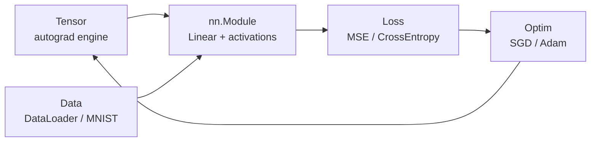

# NoTorch

Neural networks from scratch.

No PyTorch.
No TensorFlow.
Just NumPy and pain.

## What is this

NoTorch is a tiny deep learning framework written from scratch on top of NumPy. It exists for one reason: so you actually understand what `loss.backward()` does.

## Why

Because `import torch` teaches you API. Rebuilding autograd teaches you the thing itself — computation graphs, chain rule, broadcasting gradients, Adam bias correction. Every line is readable. No C++ backend. No magic.

## Features

- `Tensor` with dynamic autograd (add, mul, matmul, pow, exp, log, sum, reshape, ... )
- `nn.Module`, `Linear`, `Sequential`, ReLU / Sigmoid / Tanh / Softmax
- MSE + fused Softmax Cross-Entropy
- SGD (+ momentum), Adam
- `DataLoader` with shuffle/batching, MNIST loader
- `gradcheck`, `manual_seed`, save/load (`.npz`)
- Test suite + docs that show the math, not just the API

## Install

```bash
pip install -e ".[dev]"
```

Requires Python >= 3.11, `numpy>=1.24`.

## 60-second example

```python
import numpy as np
import notorch
from notorch import Tensor, nn

notorch.manual_seed(0)

model = nn.Sequential(nn.Linear(2, 16), nn.ReLU(), nn.Linear(16, 1))
opt = notorch.optim.Adam(model.parameters(), lr=1e-2)
loss_fn = nn.MSELoss()

X = np.random.randn(64, 2)
y = (X[:, :1] * X[:, 1:])  # learn the product. good luck.

for epoch in range(200):
    opt.zero_grad()
    pred = model(Tensor(X))
    loss = loss_fn(pred, Tensor(y))
    loss.backward()
    opt.step()
    if epoch % 50 == 0:
        print(f"epoch {epoch} loss {loss.data:.4f}")
```

## Autograd in 30 seconds

Each op records its parents. `backward()` topo-sorts the graph and pushes gradients back via the chain rule. Grads accumulate. Broadcasting is undone with `sum_to_shape`. Full writeup: `docs/autograd.md`.

```python
x = Tensor(2.0, requires_grad=True)
f = x * x + x   # 6.0
f.backward()    # df/dx = 2x + 1 = 5.0
print(x.grad)   # 5.0
```

Math reference (Linear, MSE, activations, softmax/CE, SGD/Adam): `docs/math.md`.

## Architecture



Package map and design rules: `docs/architecture.md`.

## Training examples

```bash
python examples/xor.py        # MLP learns XOR. the hello-world of nonlinear pain.
python examples/spiral.py     # 2-layer MLP on two spirals. watch decision boundary bend.
python examples/mnist.py      # MLP on MNIST. ~97% if you're patient.
```

- **XOR**: 2-8-1 MLP, BCE-style loss. Converges in seconds.
- **Spiral**: 2-64-64-2 MLP + softmax CE. The reason hidden layers exist.
- **MNIST**: 784-128-64-10 MLP, Adam, DataLoader batches. Downloads once via stdlib, caches under `data/mnist/`.

## Project structure

```
src/notorch/      # tensor, nn, optim, data, utils
tests/            # pytest suite
examples/         # xor, spiral, mnist
docs/             # autograd, math, architecture
```

## Limitations

- CPU + NumPy only. No GPU. No speed records will be broken.
- No Conv2D, no RNNs, no BatchNorm, no Dropout. Yet.
- Second-order grads? Never heard of them.
- Large models will be slow. That's the tuition fee for understanding.

## Roadmap

- [ ] Conv2D + MaxPool
- [ ] BatchNorm / LayerNorm
- [ ] Dropout
- [ ] LR schedulers (Step, Cosine)
- [ ] GPU backend (or at least CuPy-shaped dreams)
- [ ] More examples (CNN on MNIST, char-RNN)

## Contributing

Small PRs. NumPy only. Every op needs a backward and a test. See `CONTRIBUTING.md`.

## License

MIT. See `LICENSE`.

## Acknowledgments

- karpathy/micrograd — proved a weekend and a DAG is all you need.
- Every autograd tutorial that lied about broadcasting gradients being easy.
- NumPy, for doing all the actual work.
