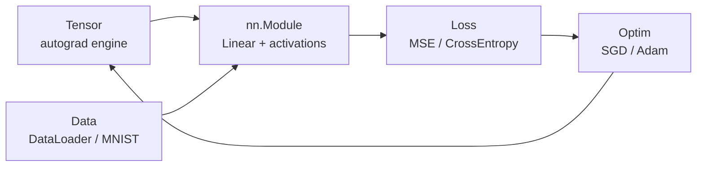

# Architecture

## Package map

```
src/notorch/
  __init__.py      # public API: Tensor, nn, optim, data, utils
  tensor.py        # Tensor + autograd engine
  nn/
    module.py      # Module, Parameter, Sequential
    layers.py      # Linear
    activations.py # ReLU, Sigmoid, Tanh, Softmax
    losses.py      # MSE, CrossEntropy
  optim/
    sgd.py         # SGD (+ momentum)
    adam.py        # Adam
  data/
    dataloader.py  # Dataset, DataLoader, shuffling/batching
    mnist.py       # MNIST loader (NumPy .npz, stdlib download)
  utils/
    seed.py        # manual_seed
    io.py          # save / load state dicts (.npz)
    gradcheck.py   # numeric gradient checker
tests/             # pytest: autograd, nn, optim, gradcheck, training smoke
examples/          # xor, spiral, mnist
docs/              # autograd.md, math.md, architecture.md
```

## Dependency flow



`Tensor` knows nothing about layers. Layers know nothing about
optimizers. The loss connects them: forward flows left to right,
gradients flow right to left, and the optimizer closes the loop by
mutating `Tensor.data` in place.

Design rules:

1. NumPy only. No torch, no TF, no JAX.
2. Every `Tensor` op ships a `_backward`. No exceptions.
3. `Module.parameters()` is the single source of truth for optimizers.
4. `DataLoader` yields NumPy; the training loop wraps in `Tensor`.
